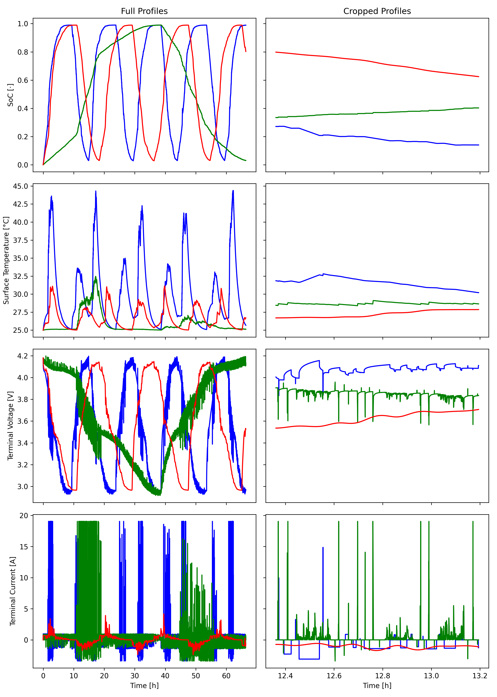
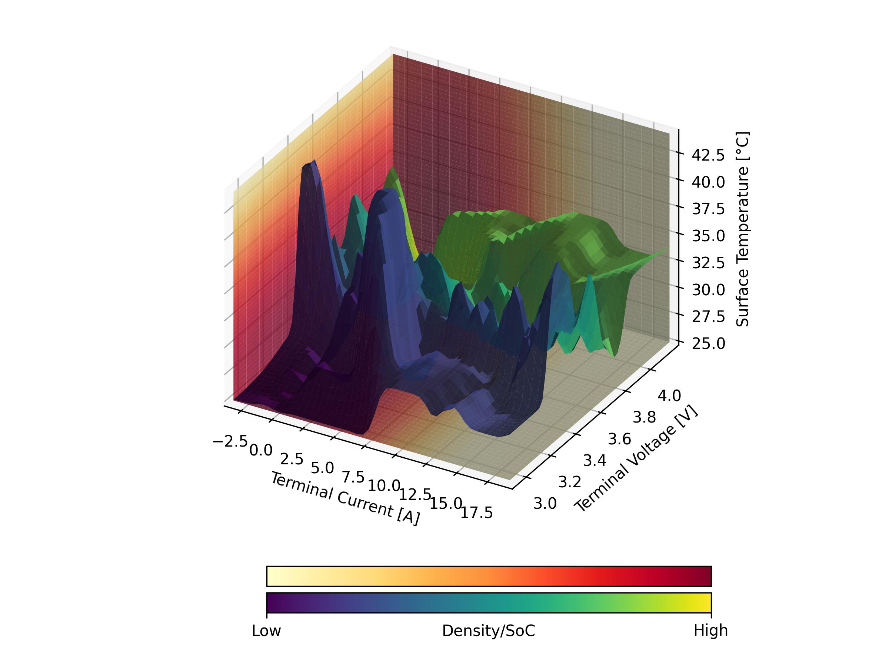
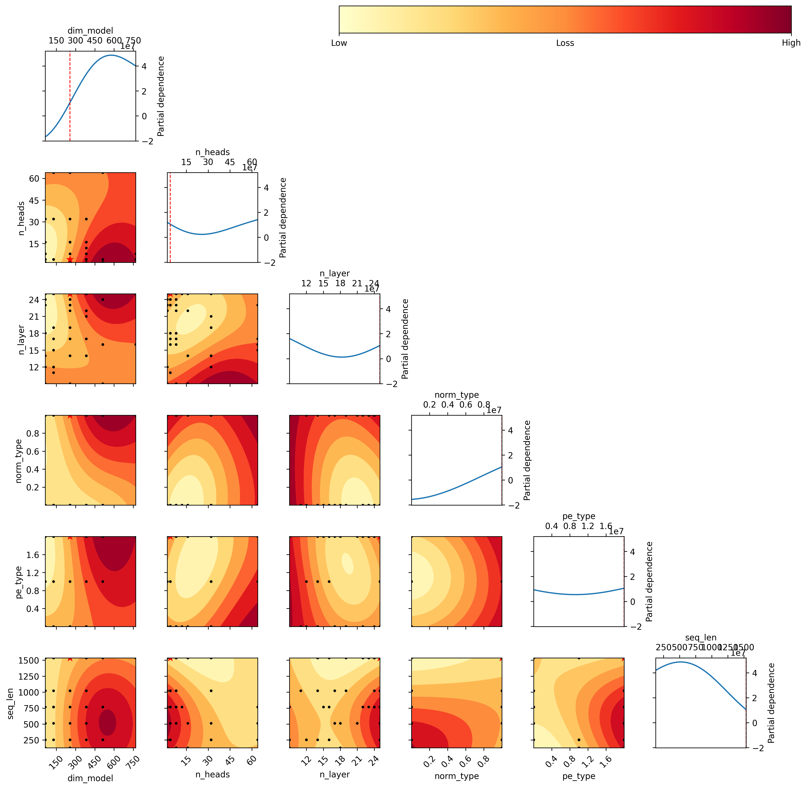
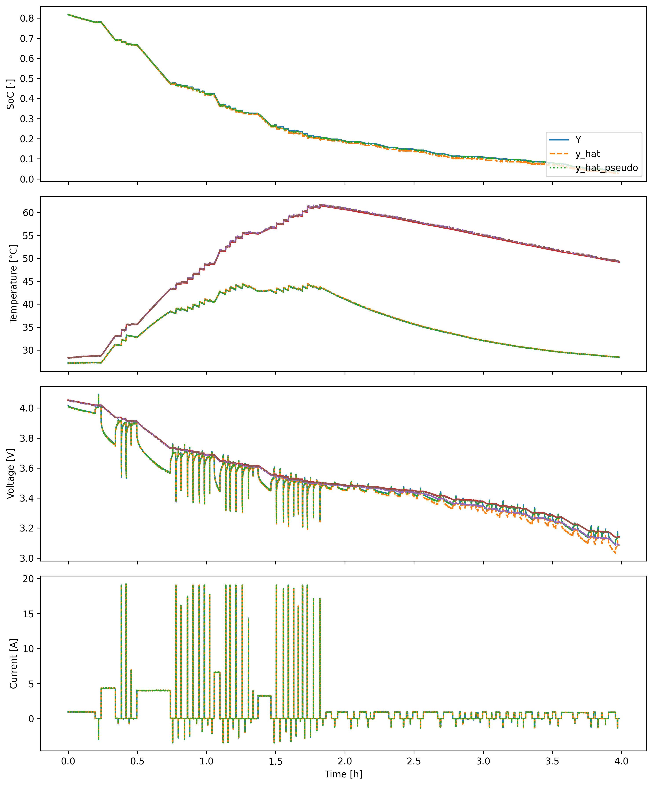

# Cell-Li-Gent

A data-driven approach for multivariate time series prediction, aiming
to simplify the battery modeling process, cut down on expensive battery
tests, and enable arbitrary parameter prediction. The project utilizes a
randomized protocol to create a synthetic dataset via electrochemical
simulation, specifically the Single Particle Model with Electrolyte
(SPMe) from [PyBaMM](https://github.com/pybamm-team/PyBaMM) \[1\]. This
dataset fuels the training of neural networks. Inspired by the
methodology laid out in my [thesis](/doc/thesis.pdf), the ultimate goal
is not just to predict battery behavior but also to explore more
efficient ways to operate batteries using an intelligent agent.

Here’s a snapshot from my [thesis](/doc/thesis.pdf) where I compared a
classic method against a neural network with around 350k parameters,
showing the latter’s competitive performance.

| Dataset | Battery-Model             | MSE    | MAE    |
|---------|---------------------------|--------|--------|
| LFP     | Data-Driven (Transformer) | 7.3e-4 | 2.0e-2 |
| LFP     | Classical (ECM)           | 3.5e-4 | 1.5e-2 |
| NMC     | Data-Driven (Transformer) | 8.3e-5 | 8.0e-3 |
| NMC     | Classical (ECM)           | 1.0e-7 | 2.9e-4 |

For context, the ECM (without a Kalman-Filter) had as input only the
current values, whereas the neural network received current, terminal
voltage, and surface temperature. The predicted output was
State-of-Charge.

## Overview

The [model](/model) directory includes the designs under consideration:

- A Transformer model based on Meta’s [Llama
  3](https://github.com/meta-llama/llama3) \[2\]
- A State-Space model based on
  [Mamba](https://github.com/state-spaces/mamba) \[3\]

This project also leverages Andrej Karpathy’s
[nanoGPT](https://github.com/karpathy/nanoGPT/tree/master).

Why choose these architectures for battery state estimation?
Transformers set the baseline in various fields due to their
versatility, while State-Space methods have been reliable in traditional
battery modeling by accounting for historical data. Both architectures
also performed well in my thesis benchmark.

### Principle

The data is processed similarly to a standard transformer model. We feed
the input space as a time series into the neural network, which then
predicts the next time step. Notably, for the terminal current (given
its random nature), the network predicts the same value as input by
mapping it onto itself. Each single input vector consists of a current
value from the “last” time step and other parameters at the time,
essentially a current value and the unaffected parameters. Voltage and
surface temperature can either be predicted in an autoregressive fashion
or sourced externally. All features except the current are treated
traditionally—predict the next time step.

We apply a per-feature loss instead of a global MSE loss, so each
feature gets its MSE calculated and then aggregated to a final scalar
loss.

### Randomized Data Profiles

Snapshot of the neural network’s input space based on real-world
measurements:

- Terminal Current (generated randomly)
- Terminal Voltage
- Surface Temperature

The current profiles come in three different variations: step profile
(blue), charging and discharging phases combined from a drive cycle
(green), and a superimposed, smoothed-out version of both (red).
 These profiles cover static and
dynamic aspects and stay within the battery’s datasheet specifications
\[4\]. Each profile includes one full charge and discharge cycle with
zero-current intervals for equilibrium data.
 The plane colors depict sample density
(low=yellow, high=red) at various input dimensions. The surface plot
colors represent SoC values (0=blue, 1=orange) at given inputs (I, U,
T). This approach forms the complete dataset for the neural networks.

## Results

Initially, I tried to skip extensive hyperparameter optimization (HPO)
and just tweak some parameters of existing models like GPT-2/3. This
shortcut failed, as seen [here](/doc/pred_plot.ipynb). Despite learning
some basic behavior trends, the model’s error rate soared in
auto-regressive settings, becoming unacceptable.

Clearly, a full HPO run is essential given our unique dataset and
varying input-output spaces compared to GPT-2/3 and my thesis.

### Hyperparameter Optimization

Mamba struggled due to a limited configuration space, but it may perform
better with a larger one. Thus, this HPO focuses solely on transformer
architecture.

The objective function for optimization is MSE loss across the last 4096
predictions for multiple time series (fixed batch size of 16, same for
all evaluations) of a total length of 16k. Since sequence length is an
optimization parameter, we aim to minimize prior input reliance for 2x
sequence length. Post this phase, the model relies purely on its own
predictions, functioning auto-regressively to the end.

The optimization uses SMAC3’s high fidelity setup including successive
halving and hyperband, with a max budget of roughly 1.5 epochs \[5\].
The figure below shows parameter interactions, based on a SVM trained on
costs and hyperparameters from SMAC3 optimization.

| Hyperparameter | Encoding | Description         |
|----------------|----------|---------------------|
| norm-type      | 0        | RMSNorm             |
| norm-type      | 1        | LayerNorm           |
| pe-type        | 0        | ALiBi               |
| pe-type        | 1        | RoPE                |
| pe-type        | 2        | Absolute (sin, cos) |

<figure>

<figcaption aria-hidden="true">hpo</figcaption>
</figure>

Notably, interactions among model dimensions, layers, etc., differ from
standard GPT-2 parameters, indicating task and domain-specific
requirements, at least for such small, specialized models.

### Model Predictions

The output plots illustrate predictions for 16k time series length for
one batch. Pseudo refers to using I, U, T as ground truth, whereas real
means using only the current as an external sample source, with other
parameters predicted auto-regressively. Both models perform impressively
with little drift over time and a small size of around 16M parameters.
Surface and core temperature share the same plot as well as terminal
voltage and OCV. 

This approach supports arbitrary parameter mapping efficiently and
enables meta capabilities as shown in different domains.

## Final Thoughts

There are more architectures to explore: xLSTM, incorporating KAN, JEPA,
diffusional approach, bidirectional Mamba, etc. Combining a/o scaling
these could also yield a promising meta-model across chemistries.
Further, improvements can be achieved with training on field/measurement
data, and incorporating RL for operating agents. The final training took
about 3 hours on a H100 GPU and the HPO run on 4xH100 took around 12
hours, but fixing bugs, especially after long training sessions, adds up
(for me a total of 1500 USD).

### Lessons Learned:

1.  Use asserts, prints, and tests for debugging, when going beyond
    standard training scripts.
2.  Build systems from scratch for deep understanding.
3.  Details matter significantly in tailoring models for new domains.
4.  HPO is costly but necessary for new domains.
5.  General principles from NLP, vision, etc. hold here too.
6.  Manage CUDA memory efficiently in HPO; start new kernels instead of
    clearing cache or workspace manually.

This project’s approach shows tremendous potential—it’s essentially a
universal curve/function fitting method. Battery modeling could be
exhaustive without out-of-distribution scenarios. While processes such
as SEI development might be challenging to sample sufficiently, such
models could compete with ECM+Kalman-Filter and high-fidelity models.
The sky’s the limit in terms of data and computation.

… and sorry, the code is in “research” stage—a mess :)

## References

\[1\]
V. Sulzer, S. G. Marquis, R.
Timms, M. Robinson, and S. J. Chapman, “Python Battery Mathematical
Modelling (PyBaMM),” *JORS*, vol. 9, no. 1, p. 14, Jun. 2021, doi:
[10.5334/jors.309](https://doi.org/10.5334/jors.309).

\[2\]
H. Touvron *et al.*, “LLaMA: Open
and Efficient Foundation Language Models.” arXiv, Feb. 27, 2023.
Accessed: May 05, 2024. \[Online\]. Available:
<http://arxiv.org/abs/2302.13971>

\[3\]
A. Gu and T. Dao, “Mamba:
Linear-Time Sequence Modeling with Selective State Spaces.” arXiv, May
31, 2024. Accessed: Jul. 10, 2024. \[Online\]. Available:
<http://arxiv.org/abs/2312.00752>

\[4\]
LG Chem, “Datasheet INR21700 M50.”
Aug. 23, 2016. Available:
<https://www.dnkpower.com/wp-content/uploads/2019/02/LG-INR21700-M50-Datasheet.pdf>

\[5\]
M. Lindauer *et al.*, “SMAC3: A
Versatile Bayesian Optimization Package for Hyperparameter
Optimization.” arXiv, Feb. 08, 2022. Accessed: Jul. 17, 2024.
\[Online\]. Available: <http://arxiv.org/abs/2109.09831>

