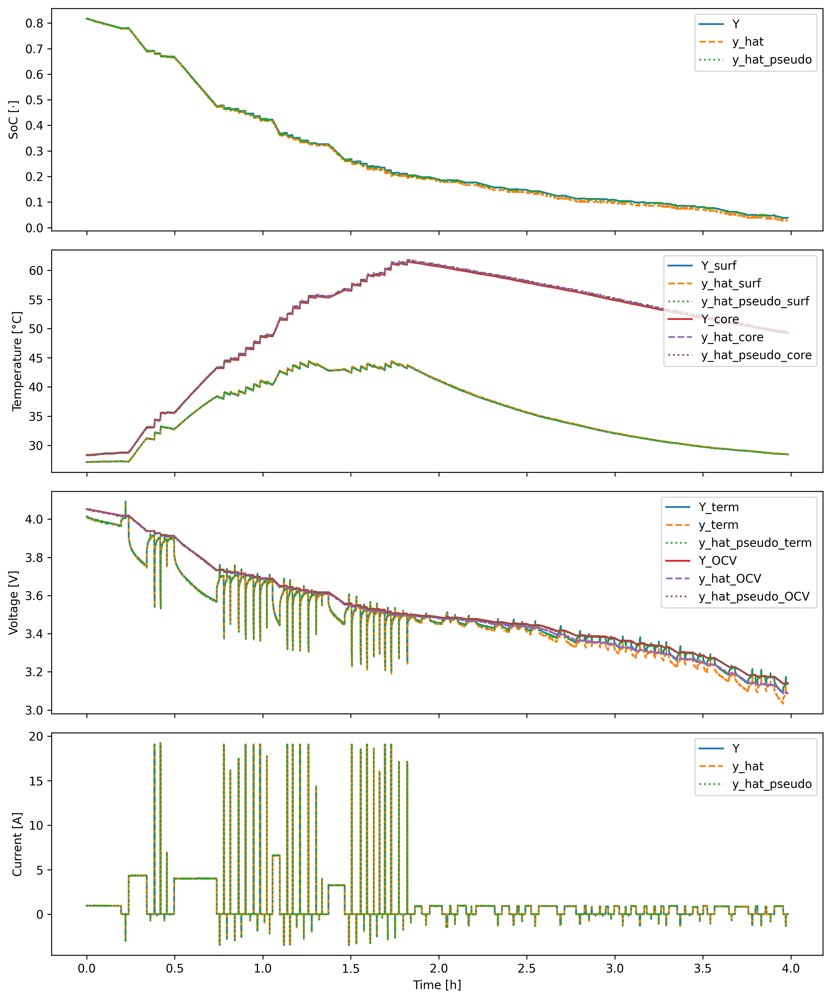
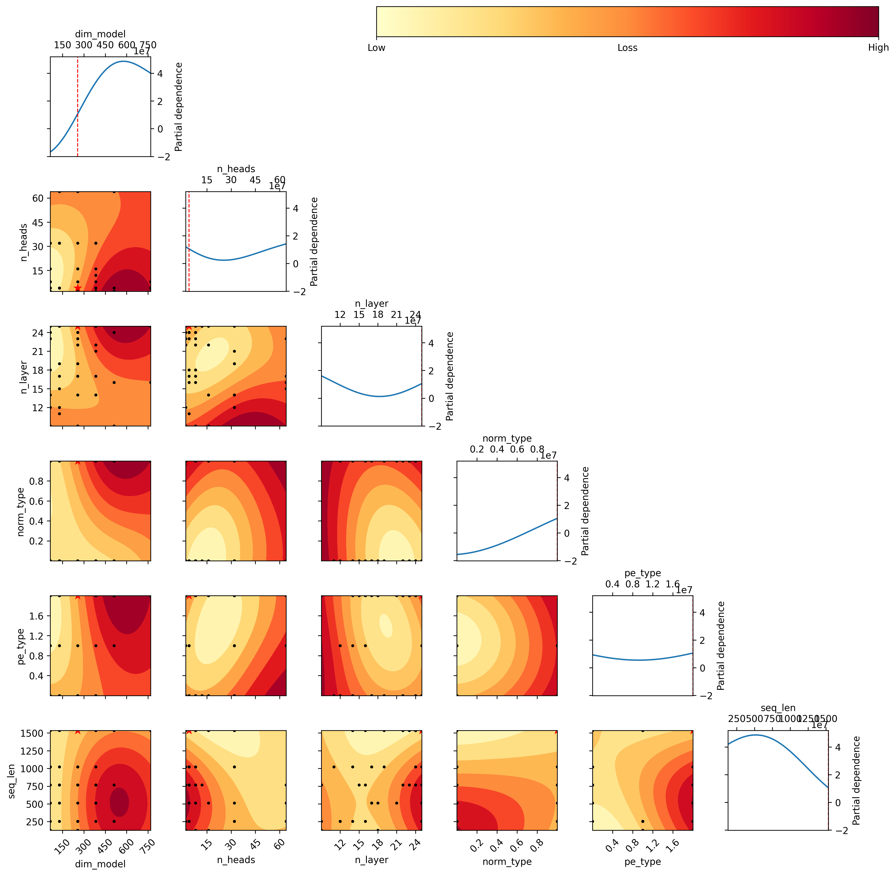
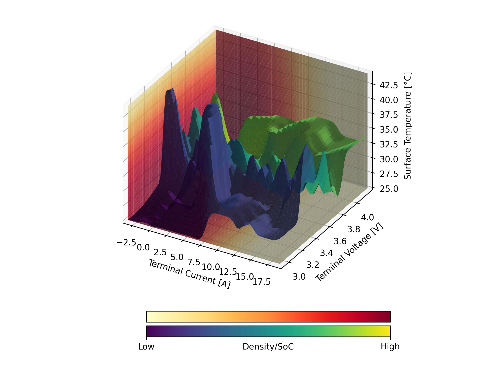
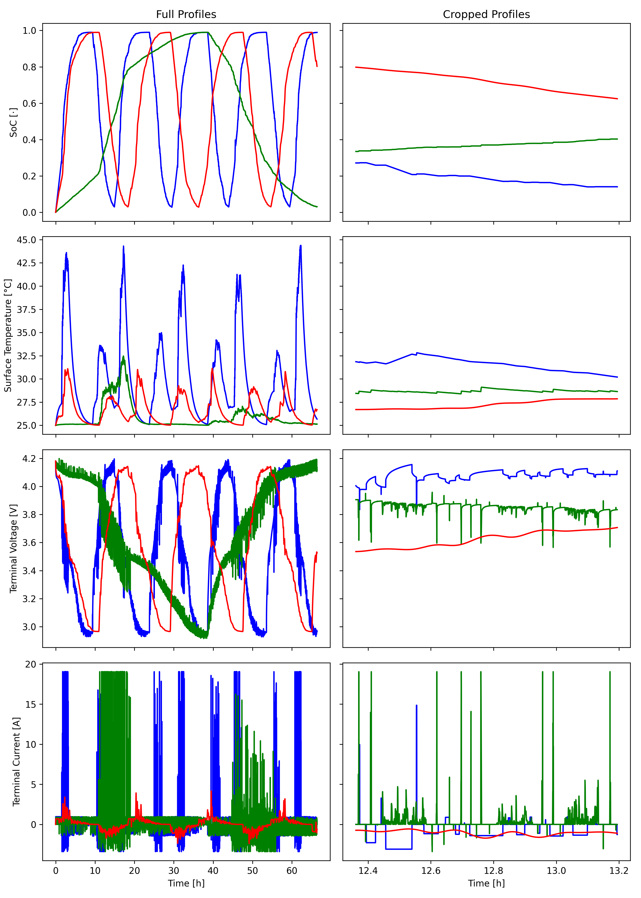
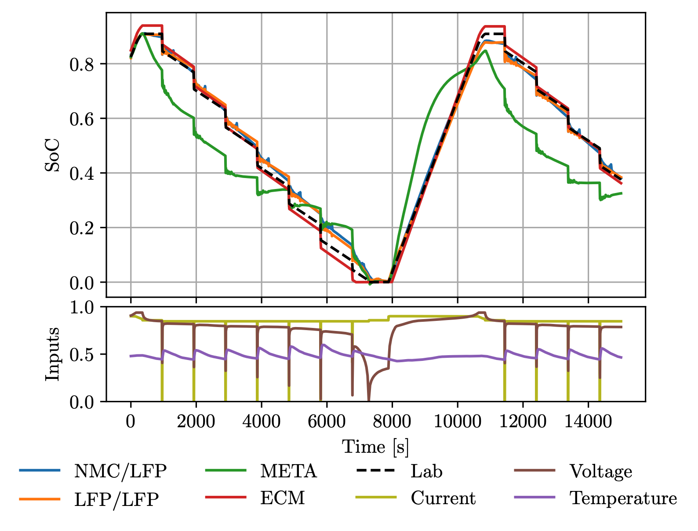
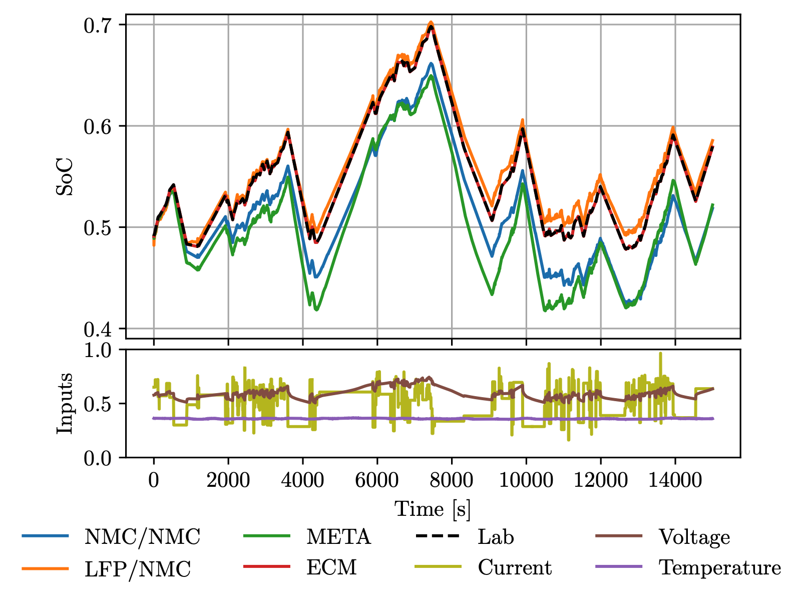
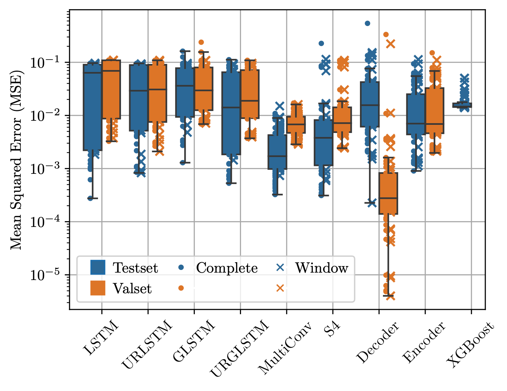

# Cell-Li-Gent

🔋**Tinkering on neural networks for battery modeling and agent-based
operating adventures** 🚀

## What is it about?

**Cell-Li-Gent** is a cutting-edge project focused on **data-driven
battery modeling** and **state estimation** using deep learning. It also
is intended to explore **battery operating strategies** utilizing
reinforcement learning (RL) agents. The primary goal is to simplify
battery modeling, reduce expensive tests, and enable the prediction of
arbitrary parameters to improve control and operation.

## Why bother?

I see **huge potential in gradient-based curve fitting**. Battery
modeling within the operating range could become exhaustive, simplifying
the problem to binary classification or anomaly detection beyond this
range.

As the renowned physicist David Witten mentioned regarding string
theory, once a robust theory is established, it becomes too valuable to
ignore. I believe the same applies to current backpropagation techniques
and high-dimensional curve fitting. With significant successes in
diverse fields like image compression \[1\], weather forecasting \[2\],
self-driving cars \[3\], high-fidelity simulations with DeepONet \[4\]
and PINNs \[5\], protein folding \[6\], AlphaGo \[7\] and AlphaTensor
\[8\] as agentic systems and NLP like ChatGPT/LLama3 \[9\], this
approach promises remarkable results.

Moreover, advancements in traditional modeling and physics directly
enhance this data-driven approach by improving data quality, leading to
mutual benefits across domains. This method also promises to:

- **Decrease development and inference time** ⏳
- **Lower requiered expertise for modeling**
- **Save costs** 💵
- **Reduce tedious tasks**, improving employee well-being 😊

## What is the market?

- **Everything with a battery**: power grid technology, renewables,
  electric vehicles (EVs), etc. 🔋
- **Battery Management Systems (BMS)**: low-level and control systems
- **State estimation**
- **Operation/charging strategy**
- **High-fidelity physics-based simulation** (Finite Element, etc.)

## What is the catch?

- The field remains largely **empirical** 📉
- **High compute requirements** become expensive 💵

## What is the plan?

### Stage 1:

- Conduct extensive **hyperparameter optimization (HPO)** and explore
  state-of-the-art (SOTA) architectures for multivariate time series
  prediction.
- Develop a **reduced-order model** that balances between ECM and DFN
  models, improving fit and simplifying testing with arbitrary output
  parameters.

### Stage 2:

- Analyze and implement **RL agents** for optimizing operating and
  charging strategies.
- Optimize the model for **real-time capability**, whether embedded or
  remote/cloud-based.
- Train the model on various chemistries to create a **meta-foundation
  model** requiring minimal fine-tuning for new cell chemistry models.

### Future Stages:

- Explore **ASIC development** and **3D modeling**.
- Discover partial differential equations (PDEs) that improves
  describing the system.

## Who are you?

I am a **passionate engineer** who enjoys making predictions and pushing
the boundaries of applied science. My goal is to translate innovative
concepts into impactful products that contribute to a better tomorrow. I
balance my “nerdy” interests with activities like socialising 😂,
traveling, kite surfing, enduro riding, bouldering, calisthenics, and
enjoy listening to electronic music. Though I collected formal education
certificates, much of my expertise is self-taught through curiosity and
a drive for innovation. I believe in **sharing knowledge** and **rapid
iteration** to foster progress.

Feel free to connect, support or chat:
marplan.battery@gmail.com \| [X](https://x.com/MarPlan_) \|
[LinkedIn](https://www.linkedin.com/in/markus-plandowski/) 🤝

## Recent Progress:

### Cell-Li-Gent, April 2024 - July 2024:

See [project repository](../README.md) for details.

- Evaluated model outputs on synthetic datasets generated with PyBaMM
  SPMe and default parameters. 
- Conducted HPO runs for Transformer (and Mamba) models.
  
- Implemented Transformer and Mamba model.
- Setup an SPMe model with a lumped thermal model for core and surface
  temperature.
- Generated synthetic datasets within datasheet limits.
   

### Thesis:

See [thesis](thesis.pdf) for details.

- Initial benchmark and **meta** learning approach, including lab data,
  with limited compute resources and expertise 😅.

## Arbitrary tools and technology tags:

- **PyTorch**
- **Single node training**
- **Python process management for freeing CUDA memory**
- **PyBaMM** with a lumped thermal model for core/surface temperature
  \[10\]
- **H5 database** with parallel reads
- **SOTA Llama3 architecture from scratch** with various positional
  encodings (Absolute, ALiBi, RoPE) \[9\], \[11\], \[12\], \[13\]
- **Tailoring SOTA reasearch models (Mamba, etc.) to multivariate time
  series domain** \[14\]
- **Feature-wise loss**
- Incorporating **Spectrogram STFT** data transformation as additional
  input encoding
- **NeoVim**

## References

\[1\]
G. Toderici *et al.*, “Full
Resolution Image Compression with Recurrent Neural Networks.” arXiv,
Jul. 07, 2017. Accessed: Jul. 19, 2024. \[Online\]. Available:
<http://arxiv.org/abs/1608.05148>

\[2\]
J. Pathak *et al.*, “FourCastNet:
A Global Data-driven High-resolution Weather Model using Adaptive
Fourier Neural Operators.” arXiv, Feb. 22, 2022. Accessed: Jul. 19,
2024. \[Online\]. Available: <http://arxiv.org/abs/2202.11214>

\[3\]
M. Bojarski *et al.*, “End to End
Learning for Self-Driving Cars.” arXiv, Apr. 25, 2016. Accessed: Jul.
19, 2024. \[Online\]. Available:
<http://arxiv.org/abs/1604.07316>

\[4\]
L. Lu, P. Jin, and G. E.
Karniadakis, “DeepONet: Learning nonlinear operators for identifying
differential equations based on the universal approximation theorem of
operators,” *Nat Mach Intell*, vol. 3, no. 3, pp. 218–229, Mar. 2021,
doi:
[10.1038/s42256-021-00302-5](https://doi.org/10.1038/s42256-021-00302-5).

\[5\]
M. Raissi, P. Perdikaris, and G.
E. Karniadakis, “Physics-informed neural networks: A deep learning
framework for solving forward and inverse problems involving nonlinear
partial differential equations,” *Journal of Computational Physics*,
vol. 378, pp. 686–707, Feb. 2019, doi:
[10.1016/j.jcp.2018.10.045](https://doi.org/10.1016/j.jcp.2018.10.045).

\[6\]
J. Jumper *et al.*, “Highly
accurate protein structure prediction with AlphaFold,” *Nature*, vol.
596, no. 7873, pp. 583–589, Aug. 2021, doi:
[10.1038/s41586-021-03819-2](https://doi.org/10.1038/s41586-021-03819-2).

\[7\]
D. Silver *et al.*, “Mastering the
game of Go with deep neural networks and tree search,” *Nature*, vol.
529, no. 7587, pp. 484–489, Jan. 2016, doi:
[10.1038/nature16961](https://doi.org/10.1038/nature16961).

\[8\]
A. Fawzi *et al.*, “Discovering
faster matrix multiplication algorithms with reinforcement learning,”
*Nature*, vol. 610, no. 7930, pp. 47–53, Oct. 2022, doi:
[10.1038/s41586-022-05172-4](https://doi.org/10.1038/s41586-022-05172-4).

\[9\]
H. Touvron *et al.*, “LLaMA: Open
and Efficient Foundation Language Models.” arXiv, Feb. 27, 2023.
Accessed: May 05, 2024. \[Online\]. Available:
<http://arxiv.org/abs/2302.13971>

\[10\]
V. Sulzer, S. G. Marquis, R.
Timms, M. Robinson, and S. J. Chapman, “Python Battery Mathematical
Modelling (PyBaMM),” *JORS*, vol. 9, no. 1, p. 14, Jun. 2021, doi:
[10.5334/jors.309](https://doi.org/10.5334/jors.309).

\[11\]
A. Vaswani *et al.*, “Attention Is
All You Need.” arXiv, Aug. 01, 2023. Accessed: Jul. 17, 2024.
\[Online\]. Available: <http://arxiv.org/abs/1706.03762>

\[12\]
O. Press, N. A. Smith, and M.
Lewis, “Train Short, Test Long: Attention with Linear Biases Enables
Input Length Extrapolation.” arXiv, Apr. 22, 2022. Accessed: Jul. 10,
2024. \[Online\]. Available: <http://arxiv.org/abs/2108.12409>

\[13\]
J. Su, Y. Lu, S. Pan, A. Murtadha,
B. Wen, and Y. Liu, “RoFormer: Enhanced Transformer with Rotary Position
Embedding.” arXiv, Nov. 08, 2023. Accessed: May 03, 2024. \[Online\].
Available: <http://arxiv.org/abs/2104.09864>

\[14\]
A. Gu and T. Dao, “Mamba:
Linear-Time Sequence Modeling with Selective State Spaces.” arXiv, May
31, 2024. Accessed: Jul. 10, 2024. \[Online\]. Available:
<http://arxiv.org/abs/2312.00752>

