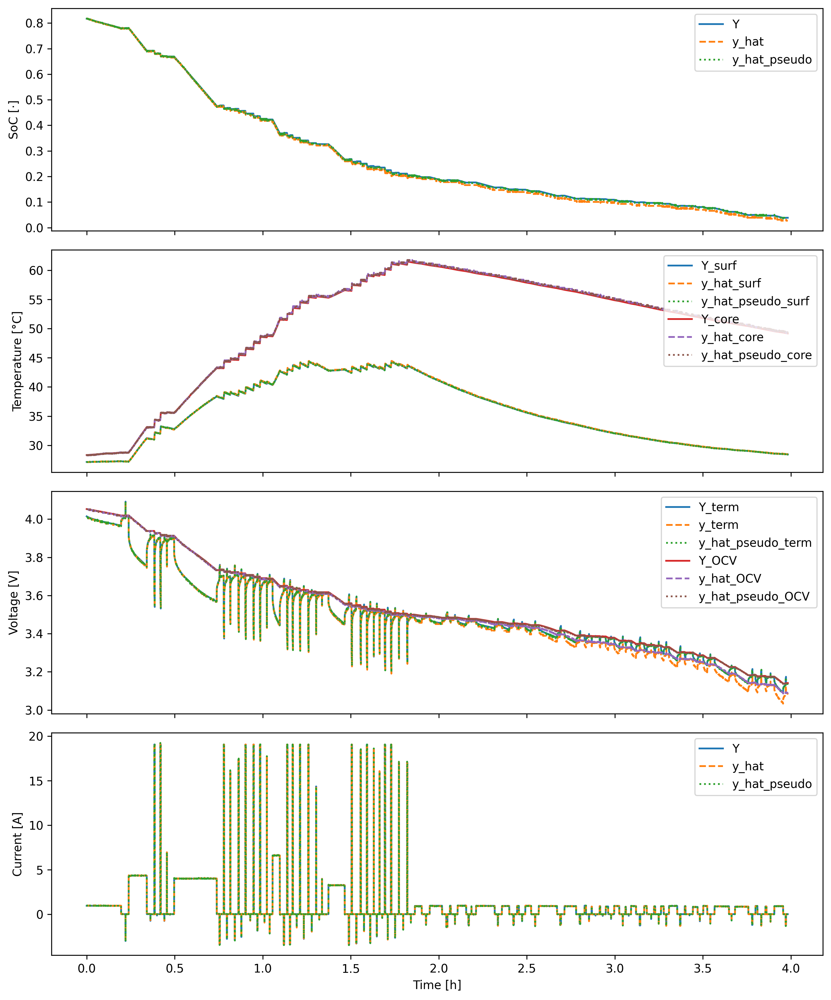
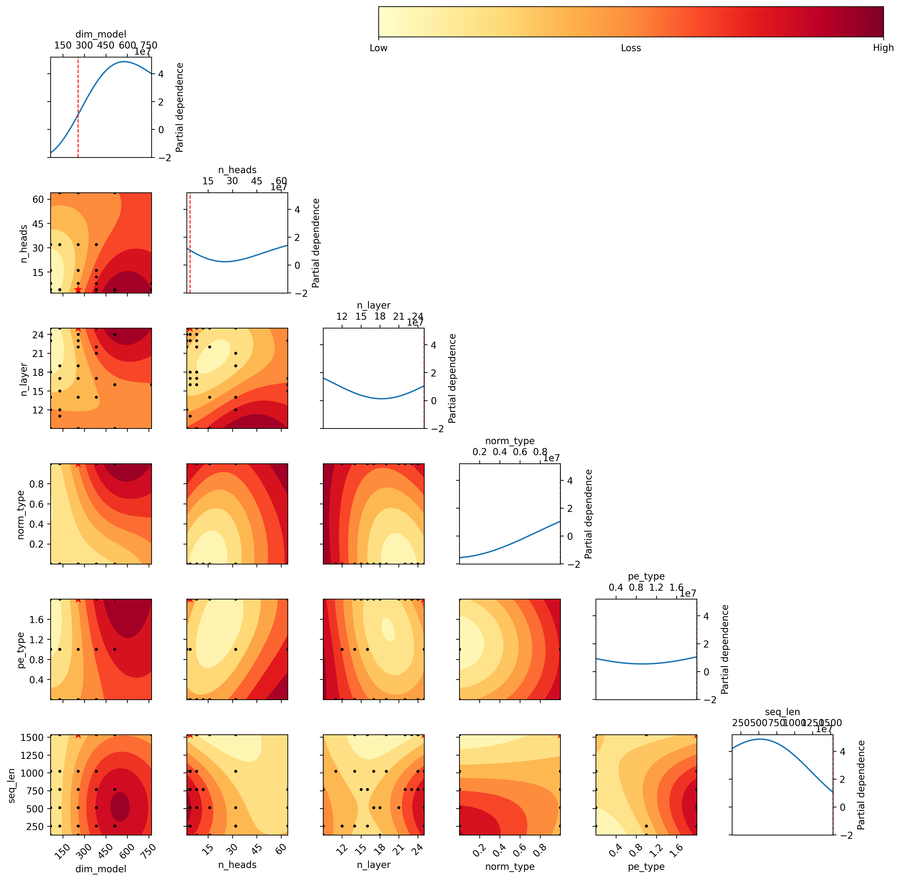
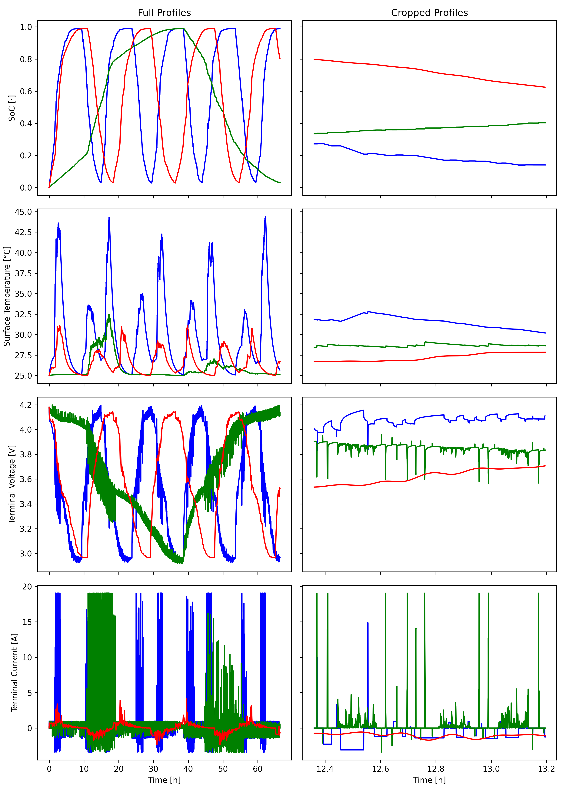
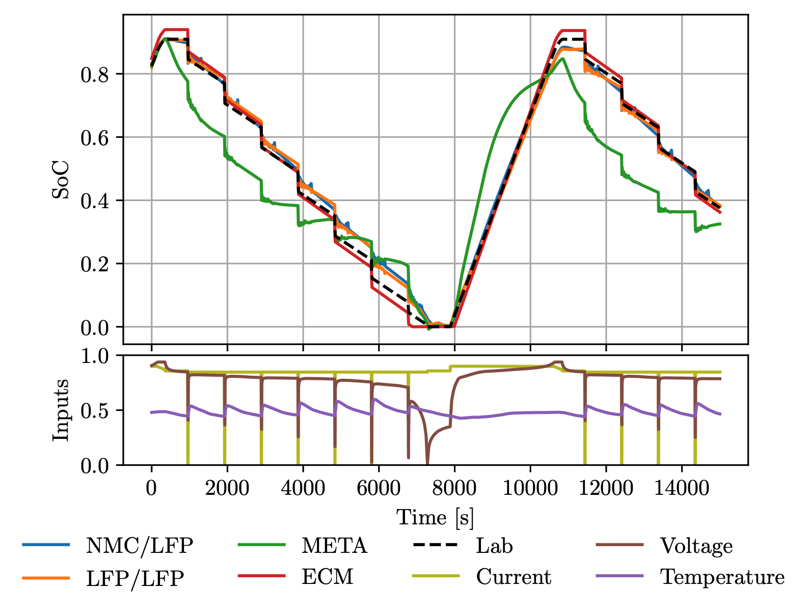
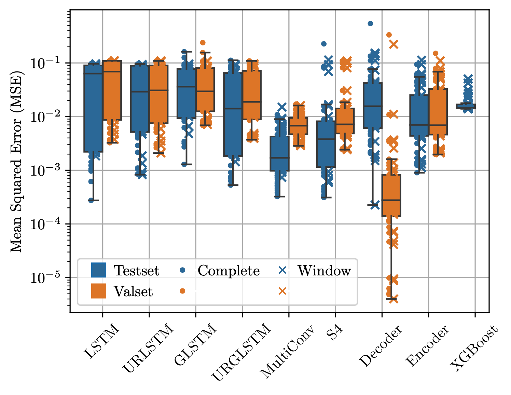

# Cell-Li-Gent
🔋**Tinkering on neural networks for battery modeling and agent-based operating adventures** 🚀

## What is it about?
**Cell-Li-Gent** is a cutting-edge project focused on **data-driven battery
modeling** and **state estimation** using deep learning. It also is
intended to explore **battery operating strategies** utilizing reinforcement
learning (RL) agents. The primary goal is to simplify battery modeling, reduce
expensive tests, and enable the prediction of arbitrary parameters to improve
control and operation.

## Why bother?
I see **huge potential in gradient-based curve fitting**. Battery modeling
within the operating range could become exhaustive, simplifying the problem to
binary classification or anomaly detection beyond this range.

As the renowned physicist David Witten mentioned regarding string theory, once
a robust theory is established, it becomes too valuable to ignore. I believe
the same applies to current backpropagation techniques and high-dimensional
curve fitting. With significant successes in diverse fields like image compression @Toderici2017, weather
forecasting  @Pathak2022, self-driving cars @Bojarski2016, high-fidelity simulations with 
DeepONet @Lu2021 and PINNs @Raissi2019, protein folding @Jumper2021, AlphaGo @Silver2016 and AlphaTensor @Fawzi2022 as agentic
systems and NLP like ChatGPT/LLama3 @Touvron2023, this approach promises remarkable results.

Moreover, advancements in traditional modeling and physics directly enhance
this data-driven approach by improving data quality, leading to mutual benefits
across domains. This method also promises to:

- **Decrease development and inference time** ⏳
- **Lower requiered expertise for modeling**
- **Save costs** 💵
- **Reduce tedious tasks**, improving employee well-being 😊

## What is the market?
- **Everything with a battery**: power grid technology, renewables, electric vehicles (EVs), etc. 🔋
- **Battery Management Systems (BMS)**: low-level and control systems
- **State estimation**
- **Operation/charging strategy**
- **High-fidelity physics-based simulation** (Finite Element, etc.)

## What is the catch?
- The field remains largely **empirical** 📉
- **High compute requirements** become expensive 💵

## What is the plan?
### Stage 1:
- Conduct extensive **hyperparameter optimization (HPO)** and explore
  state-of-the-art (SOTA) architectures for multivariate time series prediction.
- Develop a **reduced-order model** that balances between ECM and DFN models,
  improving fit and simplifying testing with arbitrary output parameters.

### Stage 2:
- Analyze and implement **RL agents** for optimizing operating and charging
  strategies.
- Optimize the model for **real-time capability**, whether embedded or
  remote/cloud-based.
- Train the model on various chemistries to create a **meta-foundation model**
  requiring minimal fine-tuning for new cell chemistry models.

### Future Stages:
- Explore **ASIC development** and **3D modeling**.
- Discover partial differential equations (PDEs) that improves describing the system.

## Who are you?
I am a **passionate engineer** who enjoys making predictions and pushing the
boundaries of applied science. My goal is to translate innovative concepts into
impactful products that contribute to a better tomorrow. I balance my
"nerdy" interests with activities like socialising 😂, traveling, kite surfing, enduro
riding, bouldering, calisthenics, and enjoy listening to electronic music. Though I collected formal
education certificates, much of my expertise is self-taught through curiosity
and a drive for innovation. I believe in **sharing knowledge** and **rapid
iteration** to foster progress.

Feel free to connect, support or chat:
[E-Mail](marplan.battery@gmail.com) | 
[X](https://x.com/MarPlan_) | 
[LinkedIn](https://www.linkedin.com/in/markus-plandowski/) 🤝

## Recent Progress:

### Cell-Li-Gent, April 2024 - July 2024:
See [project repository](../../README.md) for details.

- Evaluated model outputs on synthetic datasets generated with PyBaMM SPMe and default parameters.

- Conducted HPO runs for Transformer (and Mamba) models.

- Implemented Transformer and Mamba model.
- Setup an SPMe model with a lumped thermal model for core and surface temperature.
- Generated synthetic datasets within datasheet limits.

### Thesis:
See [thesis](../thesis.pdf) for details.

- Initial benchmark and **meta** learning approach, including lab data, with
  limited compute resources and expertise 😅.

  
  

## Arbitrary tools and technology tags:
- **PyTorch**
- **Single node training**
- **Python process management for freeing CUDA memory**
- **PyBaMM** with a lumped thermal model for core/surface temperature @Sulzer2021
- **H5 database** with parallel reads
- **SOTA Llama3 architecture from scratch** with various positional encodings (Absolute, ALiBi, RoPE) @Touvron2023, @Vaswani2023, @Press2022, @Su2023a
- **Tailoring SOTA reasearch models (Mamba, etc.) to multivariate time series domain** @Gu2024
- **Feature-wise loss**
- Incorporating **Spectrogram STFT** data transformation as additional input encoding
- **NeoVim**

## References

